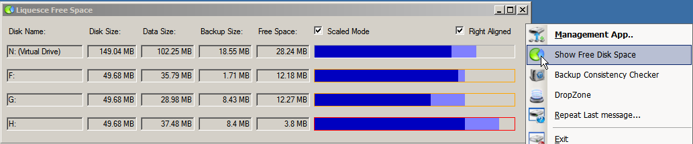
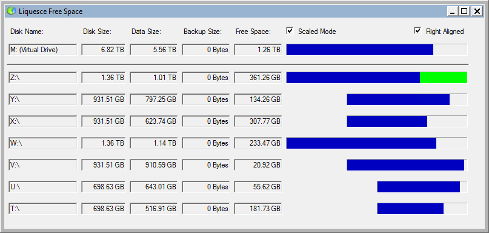
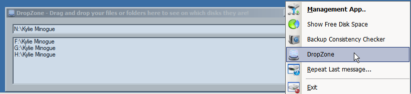

# Application Tray
**So why one of these ?**
* Need to inform the logged on user that something might be going on.
* Need to have some way of alerting the normal user that things may not be good in the new drive
	* Running out of space,
	* unable to delete,
	* Stats.
* Just need to show that it's running (Like AV's do :-)
* Application Management
* Current Space usage

## Current Space Usage
The tray app when running on the host has a menu to show the distrubtion of the space over the mount points that make up the space available.

Heres a view from XP 

- The light blue shows the amount of space currently allocated in the _backup directories
- The Red border is showing that the drive has fallen below the "Hold Of Bytes" number
- The Orange border is shwoing that the free space is approaching the "Hold Of Bytes"
- The Green indicator bar (Below) shows where the next new file is likely to be created
- All of this is updated on a timer

## Where are the directories hiding
A new drop zone window has been created that "floats" above the other windows, and allow a directory to be dragged from the explorer window and dropped on it. This will then scan the actual physical locations and display their locations in the bottom window. Here it is in XP:-
